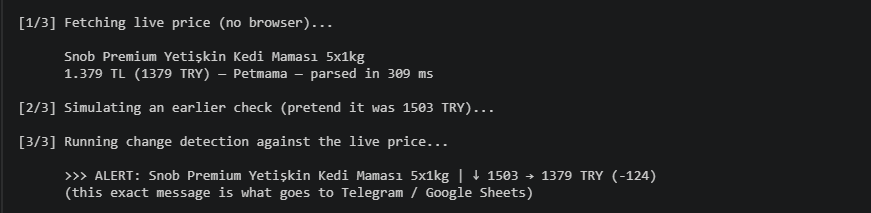

# price-tracker

Tracks e-commerce prices and tells you when they move — without a headless browser.

Fetch the product page, pull the price out of the JSON that is already embedded in the HTML,
store it, and alert on change. One dependency. Each check is a single ~200 ms HTTPS request, not a
300 MB Chromium.



## The one thing worth reading first: `fetch()` vs `node:https`

The obvious way to fetch a page in modern Node is `fetch()`. Against Trendyol, it does not work —
and the reason is the whole point of this project.

Same URL, same headers, same IP, same machine, same second:

```
node:https  ->  HTTP 200
fetch()     ->  HTTP 403
```

It is tempting to read a 403 as "I need a headless browser to look human." That is the wrong
diagnosis, and it is an expensive one — it ends with Puppeteer, ~300 MB, and seconds per check.

The real cause is narrower:

- It is **not** a TLS fingerprint — Node's default TLS stack gets a 200.
- It is **not** an IP block — `curl` from the same machine gets a 200.
- It is **not** missing headers — a full set of browser headers still gets a 403 through `fetch()`.

`fetch()` runs on [undici](https://github.com/nodejs/undici), which normalizes and **reorders**
request headers. Akamai-style bot protection fingerprints HTTP/1.1 header *order*, and undici's
order does not look like a browser's. `https.request` sends headers in the order you give them, so
it reads as an ordinary client and gets the 200.

The fix is not a bigger hammer — it is one correct line of `node:https`. That is why
[`src/http.js`](src/http.js) is built the way it is, and why "simplifying" it to `fetch()` would
silently break everything with a 403.

## No headless browser, no regex

Two more decisions in the same spirit:

**The price is already in the HTML.** Trendyol embeds the whole product as JSON in a `<script>` tag
(`window["__envoy__SHARED_PROPS"]`). The winning offer's price lives at:

```
product.merchantListing.winnerVariant.price.sellingPrice.value
```

`winnerVariant` is the seller that currently wins the buy box — the price a customer actually pays.
No browser needs to render anything to read a number that is sitting in the response.

**Parse the JSON, never regex the price.** A product page contains dozens of price-shaped strings:
list price, installments, similar products, ads. A regex picks one of them and, the day the layout
shifts, silently starts reporting the wrong number. So [`src/sites/trendyol.js`](src/sites/trendyol.js)
parses the embedded object in full and, if a field it needs is gone, throws `ParseError`. A loud
failure beats a silent wrong price: an `undefined` price looks like "no change" and the alert never
fires.

## How it works

```
fetchProduct ──▶ detectChange ──▶ recordPrice ──▶ onChange ──▶ console
   (http)          (changes)         (db)                  ├─▶ Telegram
                                                            └─▶ Google Sheets
```

| File | Responsibility |
|------|----------------|
| `src/http.js` | GET on `node:https` (the header-order rule above) |
| `src/sites/trendyol.js` | Parse the embedded product JSON → normalized product |
| `src/db.js` | Price history in `node:sqlite`; `lastPrice` returns `null` on first sight |
| `src/changes.js` | Pure `detectChange(previous, current)` — price direction + delta, stock |
| `src/watch.js` | The loop, config, and the multi-sink `onChange` dispatcher |
| `src/notify.js` | Telegram transport (one HTTPS POST) |
| `src/sheets.js` | Google Sheets transport (one appended row per change) |

Two rules the pipeline is built around:

- **A first run is never a change.** With no stored price there is nothing to compare, so
  `detectChange` reports `changed: false`. A tracker that alerts on first sight cries wolf on every
  new product and gets muted.
- **One failure never sinks the pass.** A bad page (network blip, or a `ParseError` from schema
  drift) is logged loudly and the loop moves on. Likewise, a failing alert sink is caught and
  swallowed — the change is already recorded, and losing one alert must not abort the run or block
  the other sinks.

## Install

```bash
npm install       # one dependency: googleapis (only needed for the Sheets sink)
```

Requires **Node 22+** (`node:sqlite` and `process.loadEnvFile` are built in).

## Usage

Copy the example watch list and add the products you care about:

```bash
cp products.example.json products.json
```

```json
{
  "intervalMs": 1800000,
  "delayBetweenMs": 4000,
  "urls": [
    "https://www.trendyol.com/.../-p-33491694"
  ]
}
```

Then:

```bash
npm run demo          # live end-to-end: fetch a real price -> detect a change -> show the alert
npm run watch         # loop over products.json, alert on change
npm run check:live    # one deliberate live request (see "Testing")
npm test              # 42 tests, never touches the network
```

With an empty `.env`, `watch` logs changes to the console. Configure the sinks below to also push
them to Telegram and/or a spreadsheet — nothing else changes.

## Alerts (optional)

Both sinks are off until configured. Copy `.env.example` to `.env` and fill in what you want.

**Telegram** — talk to [@BotFather](https://t.me/BotFather), create a bot, then:

```
TELEGRAM_BOT_TOKEN=...
TELEGRAM_CHAT_ID=...
```

**Google Sheets** — appends one row per change (a shareable log; sqlite already holds the full
history). Point it at a service account key and a spreadsheet the account can edit:

```
GOOGLE_APPLICATION_CREDENTIALS=./credentials/service-account.json
GOOGLE_SHEET_ID=...
GOOGLE_SHEET_TAB=Changes
```

## Testing never hits the network

`npm test` runs entirely off saved pages in `test/fixtures/`. A test that scrapes live fails when
the price changes, fails on a plane, and hammers the site on every run. Every network boundary
(`fetchImpl`, `postImpl`, the Sheets `client`) is injectable, so the suite stays offline.

The tradeoff is that fixtures go stale — which is exactly what `npm run check:live` is for: one
deliberate request that answers the only question a fixture cannot, "did their schema change?" If it
throws `ParseError`, re-save the page (`curl <url> > test/fixtures/...`), update the adapter, and the
fixture tests lock in the new schema.

## Being polite

`robots.txt` was checked: `Disallow: /` applies **only** to archive bots (`ia_archiver`,
`archive.org_bot`). Product pages are open to `User-agent: *` with no `Crawl-delay`. Even so, the
watcher waits between requests, makes one request per product, and does no bulk scraping.

## License

MIT
